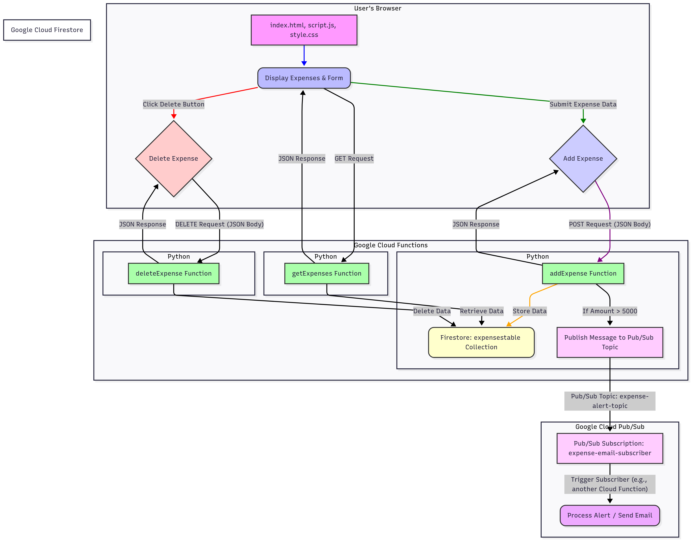
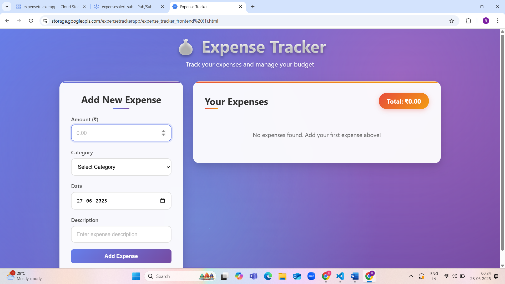

# Expense Tracker Application

This project is a serverless Expense Tracker application that allows users to record, view, and delete their daily expenses. It leverages Google Cloud Platform (GCP) serverless services for a highly scalable, cost-effective, and easy-to-manage solution.

## Table of Contents

1. [Project Overview](#mbba40dh1n7f)
2. [Features](#kdj7ed5cd1g7)
3. [Technologies Used](#7a18a4ujp9te)
4. [Architecture](#y6tcw5n0vkux)
5. [Video Demonstration](#e3wcg3q22fxu)
6. [Demonstration Screenshots](#u01vlyer9h7z)
7. [Usage](#rmqt2vmuzebs)
8. [Cost Considerations](#uv3nodz4269w)

## 1\. Project Overview

The Expense Tracker is a simple web application designed to help users keep track of their spending. It comprises a frontend hosted on Google Cloud Storage and a backend powered by Google Cloud Functions interacting with Firestore for data persistence and Pub/Sub for real-time alerts.

## 2\. Features

- **Add Expenses:** Record new expenses with details like amount, category, date, and description.
- **View Expenses:** Display a list of all recorded expenses, sorted by date.
- **Delete Expenses:** Remove individual expense records.
- **Total Amount:** Calculates and displays the total amount of all expenses.
- **High Expense Alerts:** Automatically sends a Pub/Sub message (which can trigger further actions like email notifications) for expenses exceeding a predefined threshold (e.g., ₹5000).
- **Responsive Design:** Basic UI designed to be usable across different devices.

## 3\. Technologies Used

- **Frontend:**
  - HTML5
  - CSS3
  - JavaScript (ES6+)
- **Backend (GCP Services):**
  - Google Cloud Functions (Python 3.9 runtime)
  - Google Cloud Firestore (Native mode)
  - Google Cloud Pub/Sub
  - Google Cloud Storage (for frontend hosting)
- **Deployment & Management (GCP Services):**
  - Google Cloud SDK (gcloud CLI)
  - Google Cloud Console
  - Cloud Identity and Access Management (IAM)
  - Cloud Build (for function deployment)
  - Cloud Run (underlies Cloud Functions 2nd gen)
  - Service Management API & Service Control API (enabled for service operations)

## 4\. Architecture

The application follows a serverless architecture pattern, separating the frontend from the backend logic and leveraging fully managed services.

**Key Components & Interactions:**

- **Frontend:** HTML, CSS, and JavaScript files are hosted as a static website on Google Cloud Storage. Users interact with this interface.
- **Google Cloud Functions:** Three distinct Python functions (addExpense, getExpenses, deleteExpense) act as the backend API. They are triggered by HTTP requests from the frontend.
- **Google Cloud Firestore:** A NoSQL database that stores all expense records in a collection named expensestable. Each Cloud Function interacts with Firestore based on its specific task (read, write, delete).
- **Google Cloud Pub/Sub:** A messaging service. The addExpense function publishes messages to the expense-alert-topic when an expense exceeds a certain amount. These messages can then be consumed by a subscriber (e.g., another Cloud Function) to trigger alerts.
- **IAM Roles:** Dedicated Service Accounts with specific, least-privilege IAM roles (datastore.user, datastore.viewer, pubsub.publisher, pubsub.subscriber) ensure secure and granular access to GCP resources.

## 5\. Video Demonstration

A video demonstration of the Expense Tracker application in action can be embedded here. This video will walk through the key features, showing how to add, view, and delete expenses.

## 6\. Demonstration Screenshots

This section will showcase key aspects of the Expense Tracker application through static screenshots.

**Screenshot 1: Main Application View**

- **Description:** This screenshot provides an overview of the application's main interface, highlighting the input form, the list of recorded expenses, and the calculated total.

**Screenshot 2: Adding an Expense**

- **Description:** Demonstrates the process of adding a new expense, capturing details like amount, category, date, and a brief description.

**Screenshot 3: High Expense Alert (Conceptual)**

- **Description:** Illustrates the high expense alert mechanism, showing a notification or the Pub/Sub message generated when an expense exceeds the predefined threshold.

**Screenshot 4: Deleting an Expense**

- **Description:** Shows the user interaction for deleting an expense and the immediate update of the expense list.

## 7\. Usage

1. **View Expenses:** Upon loading the page, existing expenses will be fetched and displayed.
2. **Add Expense:** Fill in the "Amount," "Category," "Date," and "Description" fields in the form and click "Add Expense." The new expense will appear in the list.
3. **Delete Expense:** Click the "Delete" button next to any expense in the list to remove it.
4. **High Expense Alert:** If an added expense has an amount greater than ₹5000, a Pub/Sub message will be published to expense-alert-topic.

## 8\. Cost Considerations

This is a serverless application, meaning you pay only for what you use.

- **Cloud Functions:** Costs are based on invocation count, CPU time, and memory usage.
- **Firestore:** Costs are based on document reads, writes, deletes, and storage amount.
- **Cloud Storage:** Costs are based on data storage, network egress, and operations (reads/writes).
- **Pub/Sub:** Costs are based on message throughput.
- **IAM & Service Accounts:** Generally no direct cost.

Monitor your **GCP Billing Dashboard** regularly to track costs. Using the asia-south1 region consistently helps minimize cross-region network egress charges.